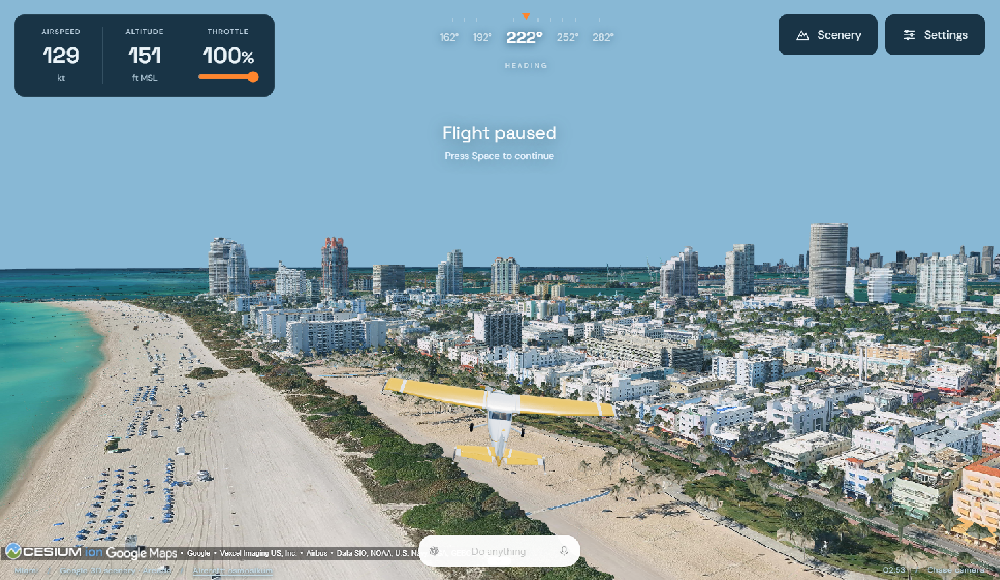

# Aeronaut



A browser flight simulator with Arcade (default) or Realistic (JSBSim) flight physics and Google Photorealistic 3D Tiles through CesiumJS.

## Run

Requires Node.js 22.12+ and npm. Node 22 is selected in `.nvmrc` and used in CI.

```sh
npm ci
npm run dev
```

Open [http://localhost:5173](http://localhost:5173). No physics server is required.
Flying requires your own Google Maps API key; there is no offline practice mode.
The key is entered in the scenery dialog, not in a `.env` file or source code.

| Command | Purpose |
| --- | --- |
| `npm ci` | Install the exact dependencies in the lockfile |
| `npm run dev` | Start the local development server |
| `npm test` | Run physics, aircraft, and camera tests, including the shipped WASM engine |
| `npm run build` | Validate the vendored runtime and build the static site in `dist/` |
| `npm run preview` | Serve the production build locally |

The predev/prebuild scripts validate the vendored JSBSim runtime without replacing
it. See [rebuilding instructions](public/jsbsim/source/BUILD.md) if you need to
change that runtime. GitHub Actions runs installation, tests, and a production
build for pushes and pull requests; no Google API key is needed for these checks.

## Fly

Choose scenery and connect with a browser-restricted Google Maps API key. Enable Map Tiles API and billing, and allow your development/production HTTP referrers. The key stays in memory and is sent to Google through Cesium tile requests; it is not persisted or sent to an application backend. Google usage charges and quota apply. See https://developers.google.com/maps/documentation/tile/get-api-key.

Flight starts airborne and paused. Arcade starts with the previous 112-knot flight setup; Realistic starts trimmed for 95 knots calibrated airspeed. Space starts/pauses. Arrow keys control pitch and bank (Down pulls up); A/D operate the rudder left/right; W/S increase/decrease throttle. F toggles Acrobatic mode, C cycles camera views, and R resets at the selected departure. Touch controls appear on narrow screens. Switching windows pauses flight. Altitude is feet MSL; airspeed is knots (calibrated in Realistic).

The scenery chooser opens on startup. Practice islands are removed. Destinations include San Francisco, New York, Rio, Montreal, Amalfi Coast, Formia, Tokyo, Los Angeles, Toronto, Vancouver, Austin, Miami, Colorado (Denver), and Grand Canyon.

## Flight dynamics

Settings → Flight physics offers Arcade and Realistic. Arcade is selected on each app load and restores the pre-JSBSim flight model from version 8, including its normal/acrobatic handling. Both choices support Acrobatic mode and the existing cameras. Changing physics pauses and resets at the current departure without reconnecting Google scenery. The choice lasts for the current session. JSBSim is downloaded only when Realistic is selected; a download failure leaves the previous setting active.

In Realistic, the app runs the actual JSBSim 1.2.4 C++ engine compiled to WebAssembly, through the pinned `@0x62/jsbsim-wasm@1.2.4-beta.4` SDK. It loads upstream Cessna 172P aircraft, IO-320 engine, and propeller definitions. JSBSim calculates forces, moments, atmosphere, propulsion, fuel consumption, and six-degree-of-freedom motion at a fixed 120 Hz. Realistic does not silently fall back to Arcade.

Within Realistic physics, Normal mode applies pitch/bank assistance through control surface commands. Acrobatic mode gives direct control of the same surfaces and uses the same aircraft model, forces, and engine. Switching modes preserves the simulation state. Acrobatic mode does not turn the Cessna into an aerobatic aircraft. Aggressive maneuvers can stall it; inverted-flight accuracy depends on the underlying model. Automatic mixture adjustment accommodates high-elevation departures. Rendering uses JSBSim's Earth-fixed position and attitude; the propeller animation follows simulated RPM.

The Realistic aircraft definition is an approximation, not a validated training simulator. There is no structural-damage simulation or user-controlled wind. Both models allow passing through Google terrain/buildings. In Realistic, contacts are not supplied to JSBSim: the simulator stops at the default sea-level surface, and passing through elevated scenery remains possible. Takeoff/landing is not a supported gameplay feature.

`npm test` verifies Arcade matches the previous model, switching both ways, failure recovery, and canceled loading. It also runs the shipped WASM engine to check trimmed cruise at four departure regions/elevations, control directions, throttle response, continuity between modes, reset, frame-rate consistency, initialization failures, and acrobatic camera framing. Existing aircraft and camera tests also run. Google imagery access requires a live key and is separate from these physics tests.

See [runtime notices and source](public/jsbsim/NOTICE.md) for versions, licenses, corresponding source archives, and rebuilding instructions.

## Rendering and assets

Press C to cycle Chase → Cockpit → Orbit. Cockpit view uses a pilot-seat position specific to each aircraft and follows its full pitch, bank, and heading, including inverted flight. Both aircraft interiors remain visible; Cessna window opacity is reduced from inside for visibility. Cockpit instruments are static details from the model, not live gauges; use the on-screen instruments for current flight data. If the Cessna asset fails to load, this camera uses an unobstructed forward view until the full model is available.

The default aircraft is “Plane” by osmosikum, with its original 2K textures and geometry. See `public/models/LICENSE.md` and the in-app credit for CC BY 4.0 attribution. The model is normalized to an 11-meter wingspan. Its presentation animation is excluded. Blue paint becomes white and white paint becomes golden orange-yellow at runtime. A procedural plane remains available during asset loading or on failure.

The aircraft uses an outdoor reflection environment, anisotropic texture filtering, and 1.75–2x rendering resolution. Google tiles target screen-space error 6, keep requests active while moving, and remove the foveated pause delay. The default in-memory tile cache is retained. Detail and streaming speed depend on Google's source coverage, network, and device. Attribution remains visible; the app does not extract tile geometry, store tiles offline, or generate navigation data.

## Structure

- `src/flight-physics.js`: model selection, lazy WASM loading, Arcade adapter.
- `src/arcade-physics.js`: simplified Arcade flight physics.
- `src/jsbsim-flight.js`: WASM lifecycle, aircraft initialization, control assistance, state mapping.
- `src/flight-state.js`: initial state and shared utility.
- `src/engine.js`: Three.js renderer, input, camera, and Cesium integration.
- `src/camera.js`: normal and aircraft-relative acrobatic cameras.
- `src/aircraft.js`: GLB loading, paint and propeller setup.
- `src/main.jsx`: React instruments, dialogs and scenery setup.
- `public/jsbsim/`: runtime, aircraft definitions, licenses, and corresponding source.


## Rafale M / F-16 option

Settings and the scenery chooser offer **Rafale M — F-16 physics** alongside the original Cessna. Selecting the jet uses the supplied Rafale GLB with its original textures, gear up, and a larger camera distance. It loads actual JSBSim F-16A dynamics, not Rafale performance data. The jet starts at 350 KCAS, uses the F-16's original fly-by-wire logic, and maps the upper half of the throttle to afterburner. Both normal and Acrobatic controls remain available. Switching aircraft pauses and resets the flight at the current departure; switching back restores the Cessna's prior Arcade/Realistic preference. Startup remains Cessna + Arcade.

The Rafale asset is by bohmerang under CC BY-NC-SA 4.0 (noncommercial, share alike). See public/models/LICENSE.md and in-app credits. The F-16 XML is GPL-licensed; full editable configuration and source notices are shipped. The JSBSim WASM runtime is rebuilt with exception handling enabled throughout the library to load the unmodified F-16 flight-control configuration. See public/jsbsim/NOTICE.md and source/BUILD.md.

## Deployment

Build with `npm run build` and serve the contents of `dist/` at the root of a
website. Model, WASM, Cesium, and credit URLs currently start with `/`; deployment
under a subdirectory such as a GitHub Pages project URL needs additional path
configuration and is not supported out of the box. Publishing the source on
GitHub does not deploy the simulator. The CI workflow only tests and builds.

Allow the deployed site's origin in your Google key's HTTP referrer restrictions.
The local `.openai/hosting.json` connection is ignored by Git and is not needed
to build or run a clone. Existing Git history may still contain its project ID;
it is deployment metadata, not a credential.

## Licenses and contributions

Original application code and documentation are available under the
[MIT license](LICENSE.md). Third-party licenses remain separate; MIT does not
cover the bundled aircraft, physics components, or Google imagery.

See [THIRD_PARTY_NOTICES.md](THIRD_PARTY_NOTICES.md) for aircraft and physics
licenses. In particular, the bundled Rafale asset is restricted to noncommercial
use. Keep attribution, license texts, and corresponding JSBSim source when
redistributing those components.

See [CONTRIBUTING.md](CONTRIBUTING.md) for development checks and
[VERIFICATION.md](VERIFICATION.md) for the scope of local verification.
